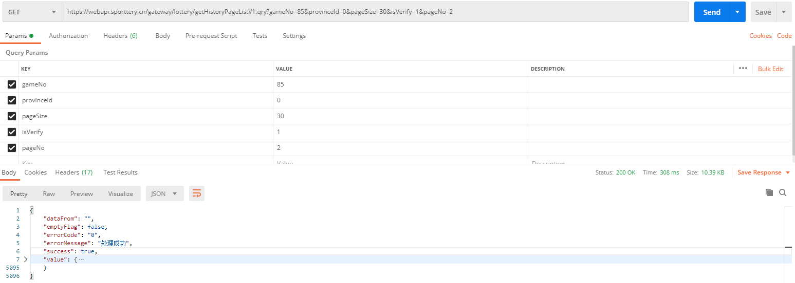

### python 爬取双色球和大乐透历史数据
> 运行时环境
>
> - flask
> - easydict
> - requests
>
> - pandas
#### 1. 大乐透

> 访问Web地址 `https://www.lottery.gov.cn/kj/kjlb.html?dlt`

**底层调用接口**

- 地址
  - `https://webapi.sporttery.cn/gateway/lottery/getHistoryPageListV1.qry?gameNo=85&provinceId=0&pageSize=30&isVerify=1&pageNo=2`

**响应数据Postman截图**

- 线程池 并发调用数据
- 全部存储到一个文件或者存储到多个CSV文件
- 只处理号码

#### 2. 双色球
> 暂定